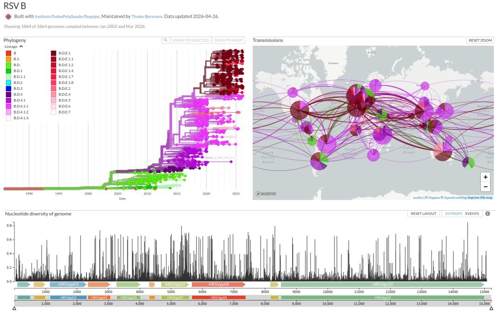

# flexpipe-RSV

Nextstrain pipeline for genomic epidemiology of respiratory syncytial virus (RSV). This tool is derived from [flexpipe](https://github.com/InstitutoTodosPelaSaude/flexpipe) and adapted for RSV, similarly to how flexpipe-dengue was created for dengue virus.

This repository contains all essential files to generate an RSV A and B Nextstrain build. Using this pipeline, users can perform genomic epidemiology analyses, visualize phylogeographic results, and track RSV spread based on genomic data and associated metadata.



## Getting started

To run this pipeline for RSV projects, see the instructions available in the original [flexpipe repository](https://github.com/InstitutoTodosPelaSaude/flexpipe), which covers Unix CLI navigation, installation of a Nextstrain environment with conda/mamba, and a step-by-step tutorial on generating a Nextstrain build (preparing, aligning, and visualizing genomic data).

## RSV subsampling (Pathoplexus metadata)

This repository includes a custom subsampling script designed for respiratory syncytial virus (RSV) datasets derived from Pathoplexus.

### Usage

Place your metadata file in the working directory with the name: metadata.tsv

Then run: python3 subsample_RSV_v4.py

### Overview Subsampling

This script performs targeted subsampling of RSV genomic metadata to generate datasets suitable for phylogenetic and phylodynamic analyses. It is specifically designed for RSV (both A and B) and assumes the structure and sampling biases typical of Pathoplexus metadata. It is not intended as a general-purpose subsampling tool.

### Filtering and preprocessing

- Includes only sequences collected from **year 2000 onwards**
- Retains records with:
  - Complete dates (`YYYY-MM-DD`)
  - Partial dates (`YYYY-MM`), normalized to the first day of the month
- Excludes:
  - Records with only year information
  - Malformed or missing dates

### Metadata quality scoring

Each sequence is scored based on:
- Date resolution
- Geographic detail
- Optional fields (e.g., genome completeness, sequence length)

Higher-quality records are prioritized during subsampling.

### Lineage handling

- Lineages are truncated to **3 hierarchical levels** (default)
- Prevents over-fragmentation
- Original lineage is retained if truncation results in empty values

### Deduplication

- Duplicate accessions are removed
- Highest-quality record is retained
- Ties are resolved randomly in a reproducible way

### Subsampling strategy

- All sequences from a **focal country** are retained
- Other countries:
  - Subsampling by **country-year**
  - Up to **20 sequences per country per year**
  - Maximum of **4 sequences per lineage per country-year**

- Global constraints:
  - Maximum of **100 sequences per country** (excluding focal country)
  - Temporal balancing:
    - ~**200 sequences per year**

### Outputs

The script generates:

- `subsample_accessions.txt` → list of selected accession IDs  
- `metadata_subsample.tsv` → filtered metadata  

### Sequence extraction

You can extract the corresponding sequences using: seqkit grep -f subsample_accessions.txt global_rsv.fasta > rsv_subsample.fasta


### Adjustments for RSV runs 

The Snakefile provided here is pre-configured for RSV, including RSV-specific parameters such as masking of untranslated regions (`mask_5prime` and `mask_3prime`), evolutionary rate (`clock_rate` and `clock_std_dev`), and root method. Example:

```python
rule parameters:
    params:
        mask_5prime = 44,    
        mask_3prime = 155,   # Use = 145 for RSV_B_reference.gb
        bootstrap = 1000,
        model = "MFP",
        root = "least-squares",
        clock_rate = 0.007,   # approximate RSV A evolutionary rate. Use = 0.009 for RSV B
        clock_std_dev = 0.0003

# Author
Thales Bermann, Instituto Todos pela Saúde (ITpS) - thalesbermann@gmail.com

# License
This project is licensed under the MIT License.
